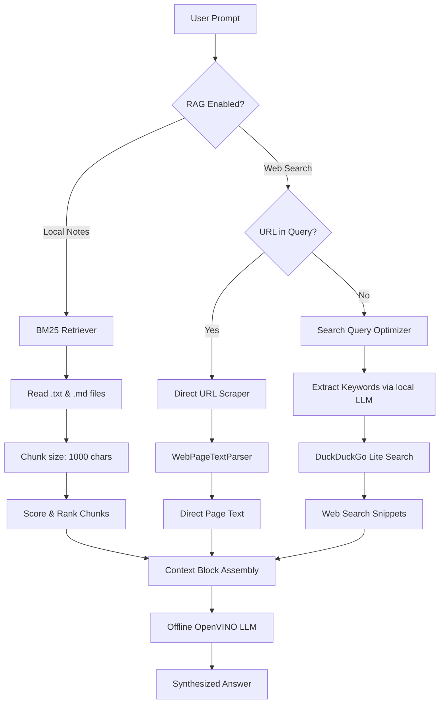

# 📚 Local RAG, Web Search, and Chat2 API Guide

This documentation details the Retrieval-Augmented Generation (RAG) capabilities, the web search framework, and the secondary `/api/chat2` endpoint implemented in this workstation.

---

## 1. 🗂️ Retrieval-Augmented Generation (RAG)

The application supports two primary sources of contextual retrieval: **Local Notes RAG** and **Web RAG**.



### A. Local Notes RAG (Mousepad Notes)
Local RAG pulls context from your local notes folder (configured in `notes_config.json`).
* **Algorithm**: It uses a native **BM25 (Best Matching 25)** ranking function to calculate matching scores for document chunks.
* **Chunking**: Chunks text files with a size of **1,000 characters** and an overlap of **200 characters** to preserve text boundary context.
* **Auto-Rebuild**: The retriever tracks the folder's modified timestamp (`mtime`). If you edit notes in your editor (e.g. Mousepad), it automatically rebuilds the search index lazily on the next user query.
* **Ignored Terms**: Standard english stopwords (e.g., *the, a, is, under*) are automatically tokenized out.

### B. Web RAG & Live Search
When Web RAG is active, the system fetches real-time web results:
* **Search Query Optimizer**: If your query is long (greater than 4 words), the offline model is prompted to extract key search terms first:
  * *Original prompt*: `"Hey, what is the capital of France and what time is it there right now? By the way, my name is John."`
  * *Optimized search query*: `"capital of France time"`
* **DuckDuckGo Lite Engine**: Queries DuckDuckGo's lite rendering engine to parse HTML results, extract page titles, snippets, and source URLs.

### C. Direct URL Scraper (Visit Website Mode)
If a URL (e.g. `http://...` or `https://...`) is detected anywhere in the prompt:
* The system bypasses search engine queries completely.
* **Scraper**: Performs a direct HTTP request using a custom user-agent.
* **HTML Parsing**: Utilizes `WebPageTextParser` (extending `HTMLParser`) to parse the visible text structure:
  * Ignores scripts, styles, metadata, navigation panels, SVGs, and footers.
  * Captures directory structures, visible links, and page bodies.
  * Deduplicates repetitive boilerplate text blocks.
* This allows the model to analyze page lists, check repository code files, or scrape target documentation dynamically.

---

## 2. 🔌 The `/api/chat2` Endpoint

The `/api/chat2` endpoint provides a lightweight, query-parameter-friendly chat interface designed for scripting, terminal integration (`curl`), and automated clients.

### Endpoint Details
* **Route**: `/api/chat2`
* **Methods**: `GET` / `POST`
* **Content-Types**: `application/json` (POST), `application/x-www-form-urlencoded` (POST), or Query string parameters (GET).

### Request Parameters
| Parameter | Type | Required | Description |
|---|---|---|---|
| `quirie` / `query` | String | **Yes** | The prompt message for the model. |
| `rag` | Boolean | No | Override Local RAG state. Defaults to backend configuration. |
| `web` | Boolean | No | Override Web RAG/Scraper state. Defaults to backend configuration. |
| `stream` | Boolean | No | Enable streaming output. Defaults to `True`. |

### Example CLI Integrations

#### 1. Basic Text Query (GET)
```bash
curl -G "http://localhost:5000/api/chat2" --data-urlencode "quirie=Explain local RAG"
```

#### 2. Query with Web Search enabled (POST)
```bash
curl -X POST "http://localhost:5000/api/chat2" \
     -H "Content-Type: application/json" \
     -d '{"quirie": "what is the current temperature in Paris?", "web": true}'
```

#### 3. Scrape Website Context directly (POST)
```bash
curl -X POST "http://localhost:5000/api/chat2" \
     -H "Content-Type: application/json" \
     -d '{"quirie": "list the files in this page https://github.com/thirumurug0xan/ai-chat-interface", "web": true}'
```

---

## 3. ⚙️ Web UI Configuration Settings

Three configuration checkboxes are exposed in the **Inference Settings** panel (represented by the ⚙️ gear icon in the workstation header):

1. **Enable Model Thinking Process**
   * **Purpose**: Instructs models (including standard models like Phi-4 or Qwen-2.5) to write out their internal chain of thought inside `<think>...</think>` blocks, which are parsed by the UI into collapsible containers.
   * **Performance note**: Generating thinking tokens takes extra time. *This setting is disabled by default to optimize local response speeds.* Unchecking this setting disables chain-of-thought generation and speeds up response times significantly.
2. **Enable /api/chat2 Endpoint**
   * If unchecked, requests to `/api/chat2` are rejected immediately with a `403 Forbidden` error.
3. **Enable Default RAG for /api/chat2**
   * Configures whether the `/api/chat2` endpoint triggers notes retrieval by default when no explicit override parameter is passed.
   * **UX Dependency**: When the endpoint is disabled, this setting is visually dimmed, locked, and user-interactions are temporarily blocked to reflect the config dependency.
